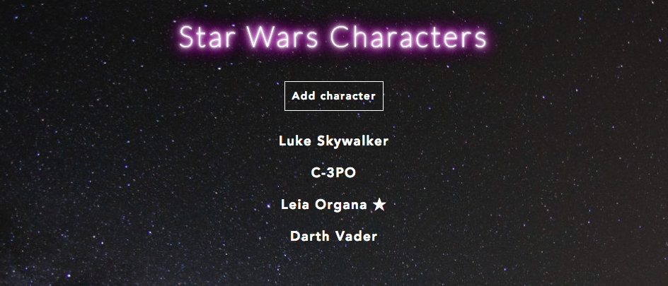
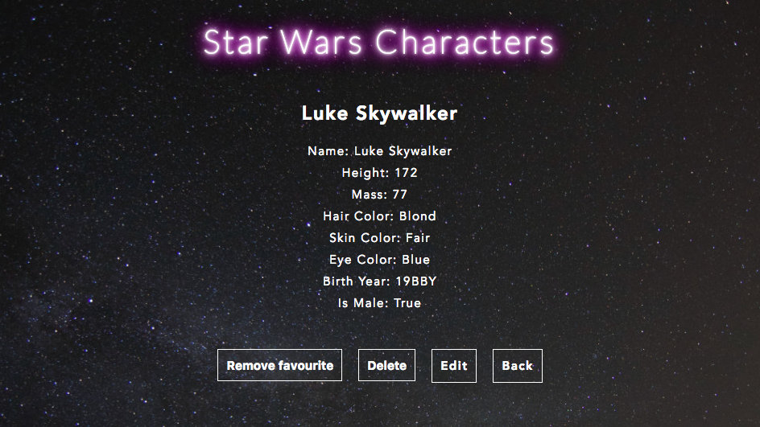
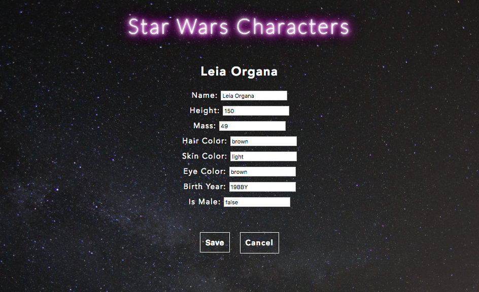

# Characters application

### Usage

* Clone this repository
* Run ```npm install```
* Run ```npm run webpack```
* Run ```node main.js```
* Go to http://localhost:3000
* Run ```npm test``` for testing

### Libraries used

* Node.js
* Express.js
* Babel
* React
* React Router
* Webpack
* Axios
* Mocha
* Chai
* WebdriverIO

### Things to do or improve

* Add unique ID for characters
* Validation for adding/editing fields
* Error messages for User
* Refactor to remove duplication
* Create smaller reusable classes

### Screenshots








### User Stories

```
As a Star Wars fan
I want to see a list of characters
So I can decide which one is my favourite
```

```
As a Star Wars fan
I want to be able to add a character
So I can be sure no characters are missing
```

```
As a moderator
I want to be able to update a character
So I can correct wrong information
```

```
As a moderator
I want to be able to delete a character
So I can remove Star Trek characters
```

```
As a Star Wars fan
I want to save my favourite characters
So I can see them later
```

```
As a Star Wars fan
I want to be able to remove a character from my favourites
So I can remove them when they join the Dark Side
```
